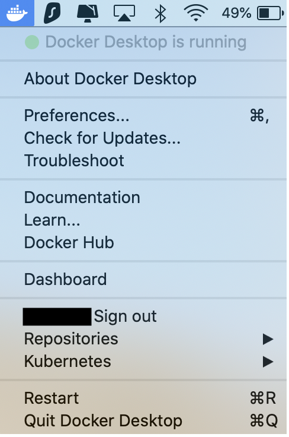

# Setup Mac

## Table of Contents

1. [Setup Docker](#setup-docker)

2. [Setup the application](#Setup-the-application)

3. [Run the application](#Run-the-application)

4. [Using the application](#using-the-application-regularly)

5. [Common setup errors](#having-troubles-check-our-common-errors--gotchas)

## Setup Docker

Docker is a platform that serves to deliver software in packages called containers. Terrastories makes use of this to deliver the 
many facets included in the application in one easy package. 

Setup instructions for Docker:

- https://docs.docker.com/docker-for-mac/install/

Download Docker:

- https://hub.docker.com/editions/community/docker-ce-desktop-mac/

There is no need to import any repositories at this point through docker. 
To verify that your docker is up and running, click on the app or check the menu bar. Docker should show that it is running: 
<br>
<div style="text-align:center">
    
</div>

## Setup the application
Create a fork of the Terrastories/terrastories repository. Now clone the repository locally to your computer. 

Using the source-code editor of your choice, open the terrastories repository. There, a file can be found called `.env.example`. 
Copy the contents of this file into a newly created file called `.env` (Do not change .env.example!).

Now navigate to a site called [Mapbox](https://mapbox.com/signup) create an account, and copy the mapbox access token (either your default public token or a new one you create) found under your acccount. 

Navigate back to the `.env` file you created and replace where it says [your pk token here] with your mapbox access token. 

Open your terminal and navigate to the terrastories repository and run:

```
docker-compose build
```

This will download and build all the docker images used in this project. Upon completion you should see output similar to:

```
...
Successfully tagged terrastories:latest
```

## Run the application

Within the terminal, run:

```
docker-compose up
```

If this fails, make sure all firewalls are turned off and you have a secure connection to the internet. If it continues to fail, check 
the [common setup errors](#having-troubles-check-our-common-errors--gotchas) section. 

This command should terminate with an output similar to:

```
terrastories_e2e_1 exited with code 0
```

Open another terminal and run the following command to setup:

```
docker-compose exec web bin/setup
```

This command runs a setup script that lives in bin/setup, which does:

- install ruby gems
- install javascript packages
- setup database
See the script file for the details.

Enter `localhost:3000` into your internet browser to view the application/

## Using the application regularly

Everytime you want to open and use the application, make sure you have docker desktop running and run the following command in the terminal: 

```
docker-compose up
```

You can view the running application at `localhost:3000`

It will take a moment to load when first opening the application 


## Having troubles? Check our common errors & gotchas

If you run into any problems getting the application to start, please check out a list of common errors & gotchas that we have put together [here](https://docs.google.com/document/d/1uSbQl56rAh3AA8Xm7IRZ8qepAMVN55ZOkAqQ8Kh423E/edit)!

Additionally, feel free to join us in Slack [here](https://t.co/kUtI3lnpW1) and find us in the channel #terrastories :) You can also post an issue and label it with `question`. We will get back to you ASAP!
