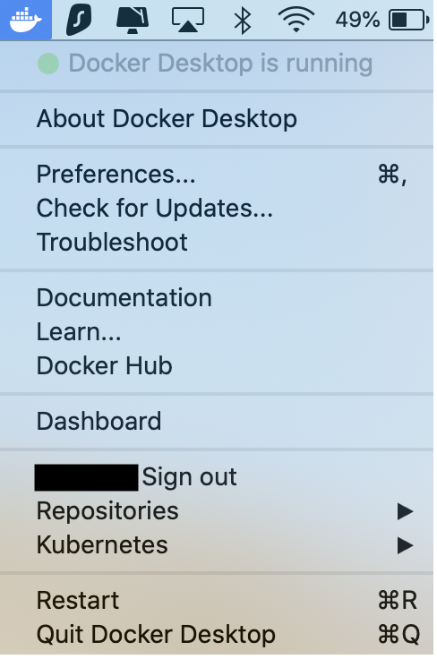

# Setup Windows

## Table of Contents

1. [Setup Docker](#setup-docker)

2. [Setup the application](#Setup-the-application)

3. [Run the application](#Run-the-application)

4. [Using the application](#using-the-application)

5. [Common setup errors](#having-troubles-check-our-common-errors--gotchas)

6. [Development](#development)

7. [Backup and restore the Terrastories database](#backup-and-restore-the-terrastories-database)

## Setup Docker

Docker is a platform that serves to deliver software in packages called containers. Terrastories makes use of this to deliver the 
many facets included in the application in one easy package. 

Download Docker:

- https://hub.docker.com/editions/community/docker-ce-desktop-windows/

System prerequisites for Windows 10 Pro: 
- 64 bit processor 
- 4GB system RAM 
- [virtualization must be enabled](https://mashtips.com/enable-virtualization-windows-10/). 

Setup instructions for Docker on Windows 10 Pro:

- https://docs.docker.com/docker-for-windows/install/

System prerequisites for Windows 10 Home: 
- Ensure that you are running on version 2004 or higher, you will need to update your system if it is running on an older version
- Enable the WSL 2 feature on Windows, follow the instructions on this link to complete this step, this includes installing a Linux distribution such as Ubuntu
- To complete the previous steps, you must have a 64 bit processor, 4GB system RAM, and [virtualization must be enabled](https://mashtips.com/enable-virtualization-windows-10/). 

Setup instructions for Docker on Windows 10 Home:

- https://docs.docker.com/docker-for-windows/install-windows-home/

There is no need to import any repositories at this point through docker. 
To verify that your docker is up and running, click on the app or check the menu bar. Docker should show that it is running: 
<br>
<div style="text-align:center">
    
</div>

## Setup the application
Create a fork of the Terrastories/terrastories repository. Now clone the repository locally to your computer. 

Using the source-code editor of your choice, open the terrastories repository. There, a file can be found called `.env.example`. 
Copy the contents of this file into a newly created file called `.env` (Do not change .env.example!).

Now navigate to a site called [Mapbox](https://mapbox.com/signup) create an account, and copy the mapbox access token (either your default public token or a new one you create) found under your acccount. 

Navigate back to the `.env` file you created and replace where it says [your pk token here] with your mapbox access token. 

Open Powershell and navigate to the terrastories repository and run:

```
docker-compose build
```

This will download and build all the docker images used in this project. Upon completion you should see output similar to:

```
...
Successfully tagged terrastories:latest
```

## Run the application

Within Powershell, run:

```
docker-compose up
```

If this fails, make sure all firewalls are turned off and you have a secure connection to the internet. If it continues to fail, check 
the [common setup errors](#having-troubles-check-our-common-errors--gotchas) section. 

This command should terminate with an output similar to:

```
terrastories_e2e_1 exited with code 0
```

Open another Powershell window and run the following command to setup:

```
docker-compose exec web bin/setup
```

This command runs a setup script that lives in bin/setup, which does:

- install ruby gems
- install javascript packages
- setup database
See the script file for the details.

Enter `localhost:3000` into your internet browser to view the application/

## Using the application 

Everytime you want to open and use the application, make sure you have docker desktop running and run the following command into
Powershell:

```
docker-compose up
```

You can view the running application at `localhost:3000`

It will take a moment to load when first opening the application 


## Having troubles? Check our common errors & gotchas

If you run into any problems getting the application to start, please check out a list of common errors & gotchas that we have put together [here](https://docs.google.com/document/d/1uSbQl56rAh3AA8Xm7IRZ8qepAMVN55ZOkAqQ8Kh423E/edit)!

Additionally, feel free to join us in Slack [here](https://t.co/kUtI3lnpW1) and find us in the channel #terrastories :) You can also post an issue and label it with `question`. We will get back to you ASAP!

## Development

Most developer contributions will be focused on the rails app. Because this project uses
docker, we already have a uniform ruby/rails development environment in our rails docker
image. Any time you need to run a rails command you should do so from a running docker
container to take advantage of this consistent environment. Use the following command to
open a bash console on the rails container:

```
docker-compose exec web /bin/bash
```

Now you can treat this console like any other development environment, running rails or
bundler commands as needed. **Please refrain from running such commands in your local
environment. Always use the rails container instead.**

Any changes to source files should be made directly in your local filesystem under the
`/opt/terrastories` directory using your preferred editing tools.

## Backup and restore the Terrastories database

Terrastories stores Places, Speakers, and Stories in a database (Postgres DB). it is possible to back these data up and restore them by running lines of code in a bash terminal. 

Using Powershell:

Backup the DB in PS with:

```
docker run --rm -v "terrastories_postgres_data:/pgdata" -v "$(pwd):/host" busybox tar -cvzf /host/db-backup-test.tgz -C /pgdata .
```

Restore a backup in PS with:

```
docker run --rm -i -v "terrastories_postgres_data:/pgdata" -v "$(pwd):/source/" busybox tar -xvzf /source/db-backup.tgz -C /pgdata
```

Note: the above code is assuming your build is called `terrastories`. It may be necessary to run `docker volume ls` to get the right Docker container name ending with `_postgres_data`.
